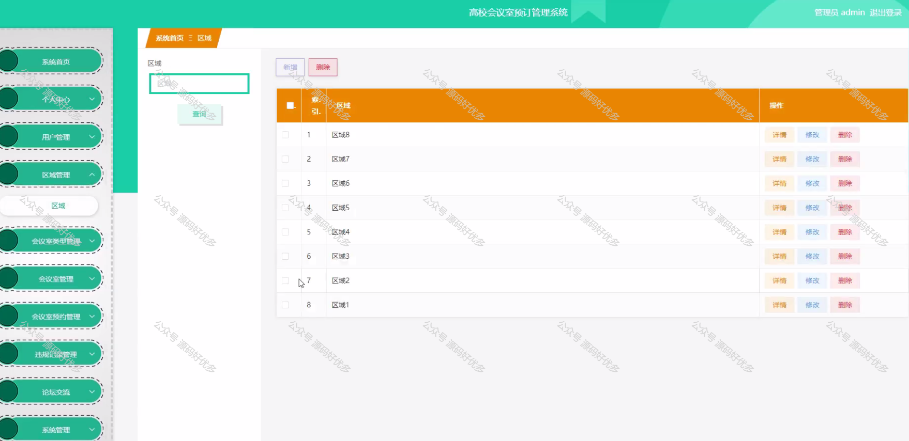

 
## 查看主页获取源码

### 一、作品包含

源码+数据库+设计文档万字+PPT+全套环境和工具资源+部署教程

### 二、项目技术

前端技术：Html、Css、Js、Vue、Element-ui

数据库：MySQL

后端技术：Java、Spring Boot、MyBatis

  

### 三、运行环境

开发工具：IDEA/eclipse

数据库：MySQL5.7

数据库管理工具：Navicat10以上版本

环境配置软件： JDK1.8+Maven3.6.3

前端Nodejs：14

### 四、项目介绍
项目编号：springbootA163

高校会议室预订管理系统的背景在于解决高校内部会议室资源分配不均、预订流程繁琐、信息不透明等问题。随着高校各类会议和活动的增多，会议室资源的需求日益旺盛，而传统的会议室管理模式往往效率低下，容易造成资源浪费。因此，开发一套智能化的会议室预订管理系统，对于提高会议室使用效率、简化预订流程、实现资源优化配置具有重要意义。

前台用户功能：首页、会议室、论坛交流、公告信息、后台管理、个人中心。

后台分为管理员和用户
管理员的功能：系统首页、个人中心、用户管理、区域管理、会议室类型管理、会议室管理、会议室预约管理、违规记录管理、论坛交流、系统管理。
用户的功能：系统首页、个人中心、会议室预约管理、违规记录管理。
### 五、运行截图

  
